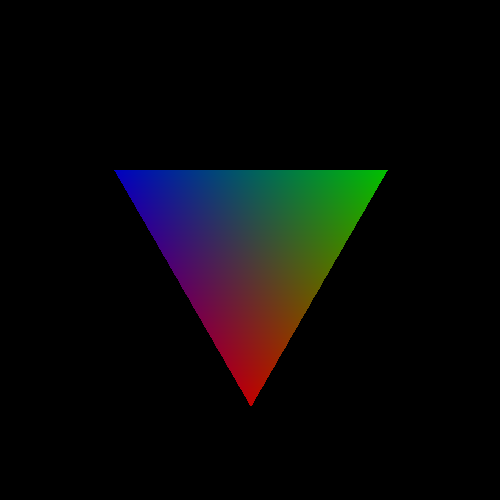
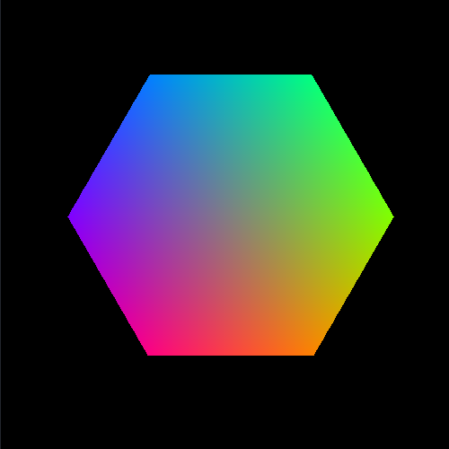
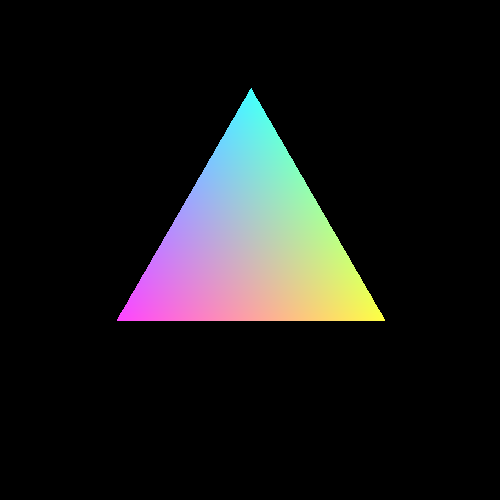

# color-cube-slicer

## Tech

**color-cube-slicer** requires [Python](https://www.python.org/) v3.9+ to run.
**color-cube-slicer** uses a number of open source projects to work properly:
- [NumPy](https://numpy.org/) -  package for scientific computing with Python;
- [OpenCV](https://opencv.org/) - library of programming functions mainly aimed at real-time computer vision;

## Installation

Get **color-cube-slicer**, install the dependencies from `requirements.txt` and run it!

```sh
$ git clone https://github.com/masyagin1998/color-cube-slicer
$ cd color-cube-slicer
$ pip install -r requirements.txt
$ ./src/main.py
```

## Examples

|              Angle             |             Image               |
|--------------------------------|---------------------------------|
| 0 |  |
| 64 |  |
| 128 |  |
| 192 |  |
| 255 |  |
